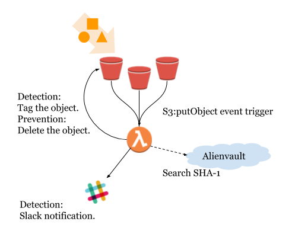

# Secure your S3 bucket using Alienvault
Hunting malware in your s3 bucket by Alienvault threat intelligence source.

# Diagram

# How to use?
1. Create alienvault account.

2. Create IAM role and Lambda

3. Setup S3 event trigger

4. Setup slack webhook(Optional, if you use "DECTION" mode)

# Fast run using cloudformation.
TBD.
