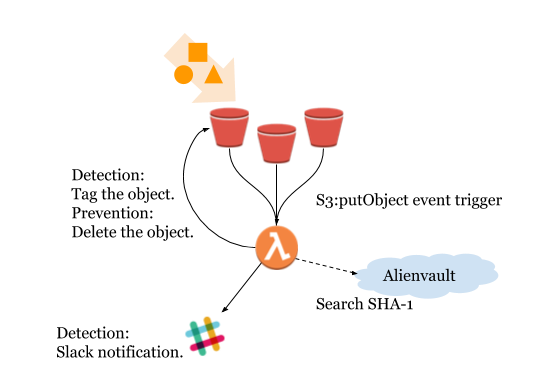

# Secure your S3 bucket using Alienvault
Hunting malware in your s3 bucket by using Alienvault threat intelligence source.
Have prevention and detection mode.

# Diagram

# How to use?
## 1. Create an Alienvault account.
Sign up an Alienvault account then go to "https://otx.alienvault.com/api" and get api key.
(Alienvault OTX: https://www.alienvault.com/open-threat-exchange)

## 2. Setup slack webhook(Optional, if you want to use "DETECTION" mode)
Follow 'https://api.slack.com/incoming-webhooks' to the 'Getting started with Incoming Webhooks' section's step 3.
Let your channel and webhook URL ready.

## 3. Create IAM role and Lambda
Creat an IAM role for lambda use and the IAM policy are shown as below.
IAM policy:
* Lambda basic execution permission
* s3:getObject
* s3:putObject

Create Lambda function then setting the enviroment variables.
Lambda's enviroment variables:
* ALIEN_API_KEY: value is your Alienvault api key.
* ALIEN_URL: 'https://otx.alienvault.com/api/v1/indicators/file/'
* ACTION: 'DETECTION' or 'PREVENTION'
* CONFIDENCE: Recommended value is '0', means any source detect this file is malware the lambda do the action(notify or remove).
* HOOK_URL: your slack webhook URL(Necessary when ACTION is DETECTION)
* SLACK_CHANNEL: your slack channel(Necessary when ACTION is DETECTION)
* LOG_LEVEL: lambda log level(Recommended value is 'info')
* TAG: Recommended value is 'TRUE'(Necessary when ACTION is DETECTION)

## 4. Setup S3 event trigger
Follow 'https://docs.aws.amazon.com/AmazonS3/latest/dev/NotificationHowTo.html' and trigger the lambda function we create.

# Quick start using cloudformation.

* Note: You can easily change region by change the URL's region(such as ap-northeast-1 -> us-east-1).
* Setup S3 event trigger is not inclue so setup the S3 event manually is necessary.

# Quick start using SAM(severless application model).
Use the sam folder to deploy.
* Setup S3 event trigger is not inclue so  setup the S3 event manually is necessary.

# License
MIT License

Copyright (c) [year] [fullname]

Permission is hereby granted, free of charge, to any person obtaining a copy
of this software and associated documentation files (the "Software"), to deal
in the Software without restriction, including without limitation the rights
to use, copy, modify, merge, publish, distribute, sublicense, and/or sell
copies of the Software, and to permit persons to whom the Software is
furnished to do so, subject to the following conditions:

The above copyright notice and this permission notice shall be included in all
copies or substantial portions of the Software.

THE SOFTWARE IS PROVIDED "AS IS", WITHOUT WARRANTY OF ANY KIND, EXPRESS OR
IMPLIED, INCLUDING BUT NOT LIMITED TO THE WARRANTIES OF MERCHANTABILITY,
FITNESS FOR A PARTICULAR PURPOSE AND NONINFRINGEMENT. IN NO EVENT SHALL THE
AUTHORS OR COPYRIGHT HOLDERS BE LIABLE FOR ANY CLAIM, DAMAGES OR OTHER
LIABILITY, WHETHER IN AN ACTION OF CONTRACT, TORT OR OTHERWISE, ARISING FROM,
OUT OF OR IN CONNECTION WITH THE SOFTWARE OR THE USE OR OTHER DEALINGS IN THE
SOFTWARE.

***
Please feel free to contact me if you have any questions. :) mailto: anderson.lin0803@gmail.com/ anderson.lin@senao.com.tw
